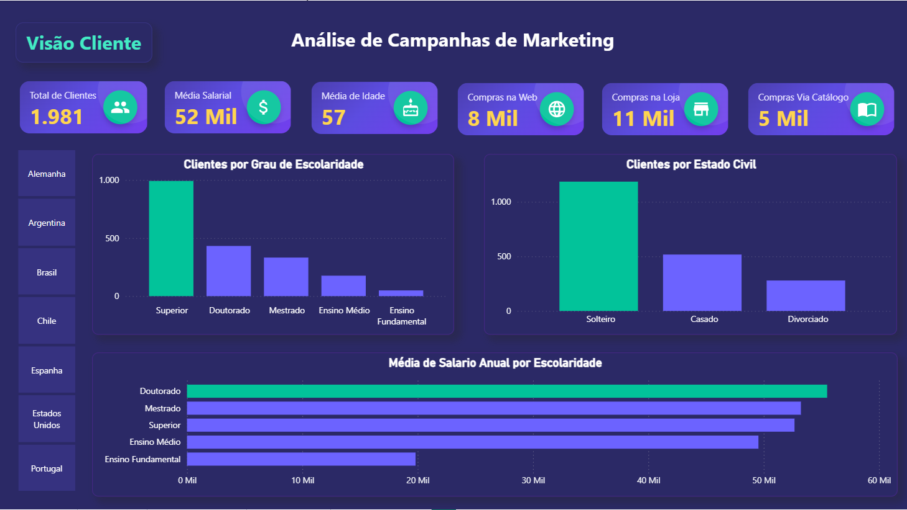
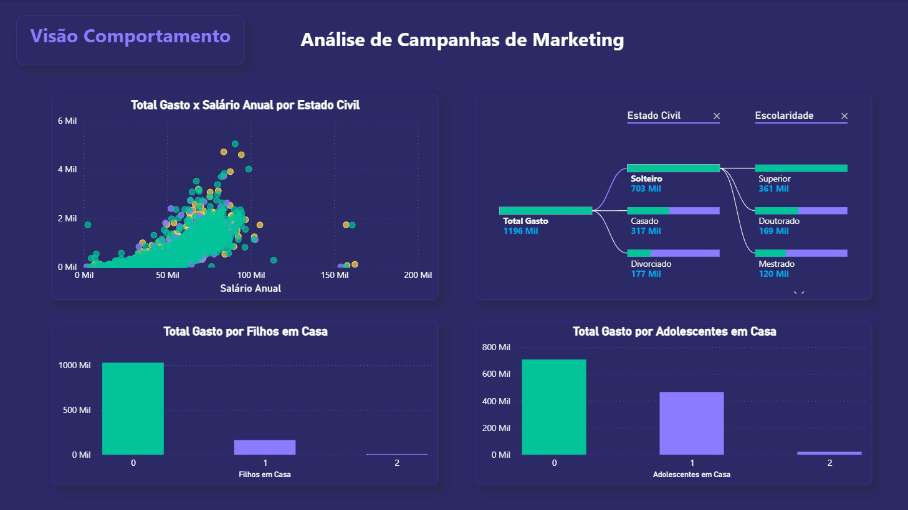
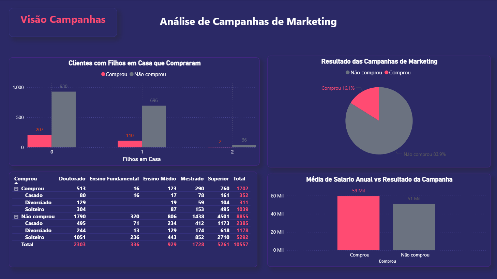
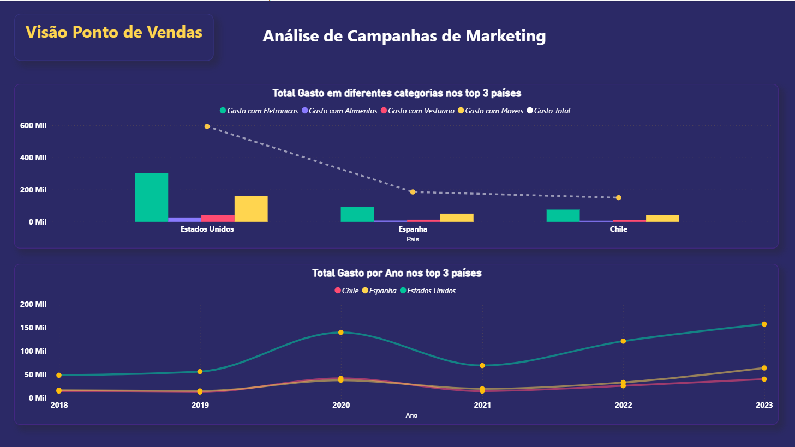

# 🚀 Marketing Campaign Analytics | PowerBI

 

## 📋 Visão Geral do Projeto
Este projeto de Análise de Dados foi desenvolvido para avaliar a performance de campanhas de marketing, o comportamento de compra dos clientes e os padrões de vendas globais. Seguindo padrões de mercado em nível de excelência, o dashboard transforma dados brutos em insights acionáveis, entregando aos tomadores de decisão uma visão 360º sobre o perfil do consumidor e a efetividade das estratégias de marketing.

O projeto conta com mais de 10 elementos visuais otimizados, formatações condicionais avançadas, Data Storytelling aplicado e customizações de interface usando HTML e CSS dentro do Power BI.

---

## 📁 Estrutura do Repositório
O projeto foi organizado para facilitar a compreensão do fluxo de dados, versionamento e documentação:

📁 Marketing-Campaign-Analytics-PowerBI
 ┣ 📂 assets                        # Prints e imagens utilizadas no dashboard
 ┣ 📂 data                          # Base de dados original (Datasets)
 ┣ 📂 dax_scripts                   # Scripts auxiliares e lógica de cartões HTML/CSS
 ┣ 📂 Marketing_Analytics.Report    # Metadados do relatório (Padrão .pbip)
 ┣ 📂 Marketing_Analytics.SemanticModel # Metadados do modelo de dados (Padrão .pbip)
 ┣ 📄 Marketing_Analytics.pbip      # Arquivo de projeto (Versão técnica versionada)
 ┣ 📄 Marketing_Analytics.pbix      # Arquivo de projeto (Versão clássica)
 ┗ 📄 README.md                     # Documentação completa do projeto

## 🎯 Estrutura de Análise (Módulos)
O dashboard foi projetado como uma aplicação interativa, dividida em 4 pilares analíticos:

1. **Visão do Cliente:** Análise demográfica aprofundada (idade, escolaridade, estado civil e média salarial).
2. **Visão de Comportamento:** Padrões de gastos cruzados com características familiares (filhos/adolescentes) e renda.
3. **Visão de Campanhas:** Avaliação de performance, conversão (Comprou vs. Não Comprou) e impacto no ticket médio.
4. **Ponto de Vendas:** Análise temporal e geográfica, ranqueando os países e categorias de maior rentabilidade.

---

## 🖥️ Telas do Dashboard

### 1. Visão do Cliente


### 2. Visão de Comportamento


### 3. Visão de Campanhas


### 4. Visão de Ponto de Vendas


---

## ⚙️ ETL e Tratamento de Dados (Power Query)
Os dados brutos passaram por um rigoroso processo de limpeza e transformação no Power Query Editor para garantir a integridade do modelo:

* **Tabela Fato (`dados_mkt`):** 
  * Promoção de cabeçalhos e filtragem de linhas nulas/inválidas.
  * Padronização de dados (múltiplas etapas de `Valor Substituído` para corrigir inconsistências, ex: mapeando flags de compra).
  * Tipagem estrita de dados para otimização de performance.
* **Dimensão de Tempo (`dim_calendario`):**
  * Tabela gerada dinamicamente a partir das datas de cadastro.
  * Extração de features temporais (Ano, Mês, Dia).
  * Criação de `Coluna Condicional` para nomes de meses e remoção de duplicatas para garantir integridade referencial (Relacionamento 1:N).

---

## 🧠 Modelagem e Linguagem DAX
O projeto utiliza um modelo relacional otimizado e uma tabela de medidas (Measure Table) isolada para organização de cálculos complexos. Abaixo estão algumas das principais métricas desenvolvidas em DAX:

**Retenção e Engajamento:**
```dax
Retenção Campanhas = 
VAR ComprouUma = CALCULATE(COUNTROWS(dados_mkt), dados_mkt[Total Campanhas] >= 1)
VAR ComprouDuas = CALCULATE(COUNTROWS(dados_mkt), dados_mkt[Total Campanhas] >= 2)
RETURN 
DIVIDE(ComprouDuas, ComprouUma)

```

**Taxas de Conversão e Participação:**

```dax
Tx Conversão Geral = 
DIVIDE(
    CALCULATE(COUNTROWS(dados_mkt), dados_mkt[Comprou] = 1),
    COUNTROWS(dados_mkt)
)

Tx Participação = 
DIVIDE(
    [Total Gasto Medida],
    CALCULATE([Total Gasto Medida], ALL(dados_mkt[Pais]))
)

```

**Métricas de Receita e Volume:**

```dax
Total Clientes = DISTINCTCOUNT(dados_mkt[ID])

Ticket Médio = AVERAGE(dados_mkt[Total Gasto])

Compras Web = DIVIDE(SUM(dados_mkt[Numero de Compras na Web]), 1000)

```

---

## 🎨 UI/UX e Data Storytelling

Para elevar a experiência do usuário final, o visual padrão do Power BI foi substituído por técnicas avançadas de design e navegação:

* **HTML Content no DAX:** Criação de botões de navegação e cartões de indicadores renderizados inteiramente via código HTML/CSS dentro de medidas DAX (com degradês, sombras dinâmicas e ícones SVG customizados).
* **Navegação Transparente:** Uso de botões invisíveis sobrepostos aos elementos HTML para garantir uma transição de páginas fluida.
* **Dark Mode & Paleta Estratégica:** Utilização de fundo escuro com destaques categóricos (Verde e Amarelo para os maiores ofensores/resultados) e paleta contrastante (Coral vs. Cinza) para destacar a taxa de sucesso das campanhas sem sobrecarregar a visão (Data Storytelling).
* **Tabelas Flutuantes:** Matrizes formatadas com fundos transparentes, barras de dados integradas e total remoção de poluição visual.

---

## 🚀 Como Visualizar

1. Faça o clone deste repositório:

```bash
git clone [https://github.com/SeuUsuario/Marketing-Analytics-PowerBI.git](https://github.com/SeuUsuario/Marketing-Analytics-PowerBI.git)

```

2. Abra o arquivo `Marketing_Analytics.pbix` no Power BI Desktop.
3. Navegue utilizando os botões interativos na página inicial.

---

## 👨‍💻 Autor

**Felipe Tamiozzo**
*Analista de Dados*

* [LinkedIn](https://www.google.com/search?q=https://linkedin.com/in/felipetamiozzo/)
* [Portfólio/GitHub](https://github.com/felipetamiozzo)

```


